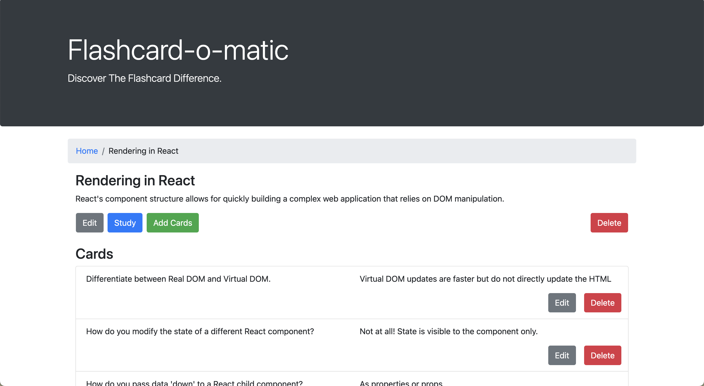
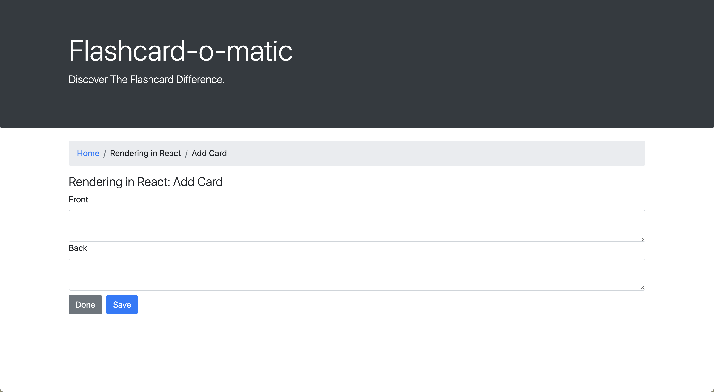
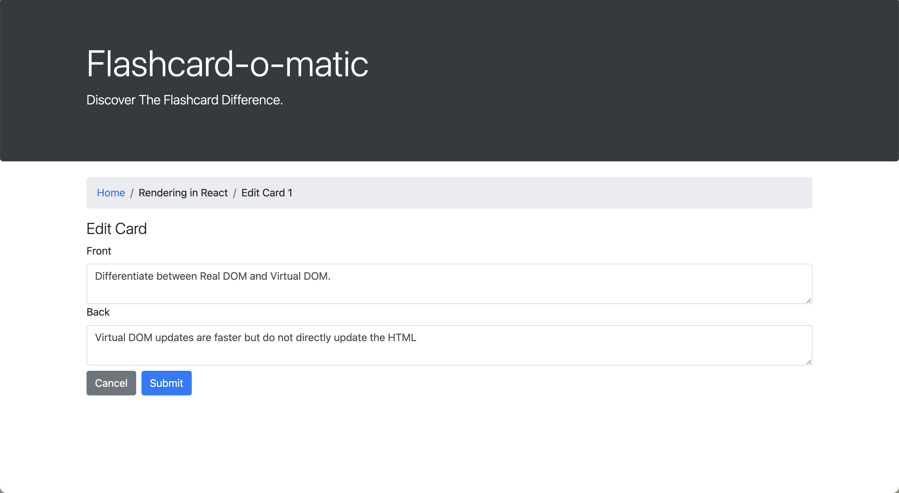

# Flashcard-o-matic

Flashcard-o-matic is designed to help students organize their study material using flashcards. With this app, you can create decks to keep topics and subjects in one place. You can then add cards to decks and study them.

With a simple and easy to use UI, Flashcard-o-matic makes it easy to study with no distractions.

This project was part of an assignment in Thinkful's software engineering immersion bootcamp. This project focused heavilly on my understanding of React including hooks like useState and useEffect. 

The app came with a RESTful api to utilize and implement in the app. 

### Home Page

The home page is where you'll find all of your study decks and the option to create a new deck. Each deck has three buttons: view, study, and delete.

Clicking delete will bring up a modal in the browser window to confirm your decision and the deck with be deleted.

### Creating a deck

This form uses a common component that can also be found on the edit deck page. Just fill out the fields with valid values and add the deck to your app. Submitting this form will initiate an empty deck that you can add cards to later. After submitting, you're automaticallly brough to the deck's page.

### Viewing a deck

When viewing a deck's designated page, general information about the deck is displayed. You have the option to also delete the deck from this page and the same modal will pop up as it would on the home page. Additional options to edit, study, or add cards to the deck are available as well.

The cards of the deck are listed right under the deck's description and buttons. Cards can be edited or deleted from here.

You also have access to a breadcrumb under the jumbotron component to get back to the homepage. Every page has this breadcrumb except the home page, making the home page easy to access from anywhere.

### Studying a deck

When studying a deck, the breadcrumb keeps track of what deck you're in and what's being done with it. 

To study a deck, you need at least 2 cards. Otherwise, an error will appear and give you the prompt to add cards. 

Studying the deck follows the order of the cards, there is no shuffle feature ***yet***. The front of the first card is shown first by default and the cards are progressed through by flipping them and moving onto the next card. At the end of studying all cards, there's an option to restart. Another modal will pop up to confirm what action you want to take. If you restart, the cards will start back from the beginning and the process repeats. If you decline to restart, you're taken back to the deck page. 

### Editing a deck

When you choose to edit a deck, the current information in the deck is inside of the fields and it able to be edited. You can cancel and none of your changes will apply and you'll be brought back to the deck's page. Once you save your changes, you'll also be brought back to the deck's page but with the changes applied. 

### Adding a card

This form is another common component reused here and in the Edit Card page. Once you've filled out the form, should you click save or done? 

Clicking either one will add the card to the deck. 'Save' will clear the form and allow you to continue to add as many cards without having to leave the page. Once you're actually done adding one or more cards, 'Done' will bring you back to the deck page and *voila*, all your cards you've added are ready and waiting to be studied. 

### Editing a card

With the same component used to add a card, editing one is just as simple. The card's information comes along with it and can be directly edited.